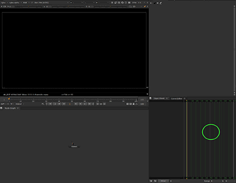

# LGA Nuke Shortcuts

Two keyboard shortcuts for things Nuke makes you do with several clicks: **setting a key on a knob**
and **framing all your keys in the Dope Sheet**.

It works like a small macro. When you press the shortcut, the app does for you the same clicks and
keys you would do by hand, in a fraction of a second, and then gives you back the mouse where it was.
It doesn't change Nuke, doesn't install anything inside Nuke and doesn't touch your scripts.

## What the shortcuts do

| Shortcut | What it does | What it replaces |
| --- | --- | --- |
| **Ctrl+Shift+D** | Sets a key on the knob under the mouse pointer. | Right click on the knob → *Set key*. |
| **Ctrl+Alt+Shift+D** | Selects every key in the Dope Sheet and frames them all. | Click the Dope Sheet → Ctrl+A → F, and back to what you were doing. |

The shortcuts only work while **Nuke is the app in front**. In any other app the same keys do
whatever they normally do there, as if Nuke Shortcuts wasn't running. It works with any version of
Nuke, NukeX and Nuke Studio.

On macOS, Ctrl becomes **⌘**, the same way it does in Nuke. You can change both shortcuts from the
Settings window.

## Set it up once: tell it where your Dope Sheet is

*Frame Dope Sheet* needs to click inside your Dope Sheet before it selects and frames. Since every
artist has their own panel layout, you show the app where it is, once:

1. Open Nuke with the Dope Sheet visible.
2. Open **Calibrate Dope Sheet...** from the tray menu or from Settings, and click **Start**.
3. Click an empty spot inside the Dope Sheet, like the circle in this picture. Esc cancels.

The spot is saved relative to the Nuke window, so it keeps working if you move the window, resize it
or open Nuke on another monitor. Calibrate again only if you change where the Dope Sheet sits in your
layout.

## Where it lives

The app runs in the Windows tray (the icons next to the clock), or in the menu bar on macOS. Click
its icon for Settings: pause the shortcuts, change them, calibrate the Dope Sheet, start with
Windows, and check for updates. Closing the window keeps it running; **Quit** in the menu closes it.

## Install

- **Windows:** run `LGA_NukeShortcuts_Setup_v<version>.exe` from the
  [releases](https://github.com/legandrop/LGA_NukeShortcuts/releases). No admin rights needed. It
  starts with Windows by default, and you can turn that off in Settings.
- **macOS:** coming soon. The app will ask for **Accessibility** access, which macOS requires before
  an app can send clicks and keys to another app.

If you used the older AutoHotkey version, close it and remove it from the Windows startup before you
start this one: both can't hold the same shortcuts at once.

## Build

Qt 6.5 with MinGW (Windows) or Homebrew Qt 6 (macOS), CMake and Ninja.

- Windows: `compilar.bat` (Debug in `build\`), `compilar.bat --release`, `deploy.bat` (portable
  folder in `deploy\`) and `instalador.bat` (Inno Setup 6 installer).
- macOS: `./compilar.sh` (Debug in `build/`), `./compilar.sh --release`.
- `LGA_NukeShortcuts --self-test` checks the logic that doesn't need a screen.

## Older version

The original AutoHotkey version (v1.x, Windows only) is in [`Legacy_AHK/`](Legacy_AHK/).

Lega Pugliese · [github.com/legandrop](https://github.com/legandrop)
